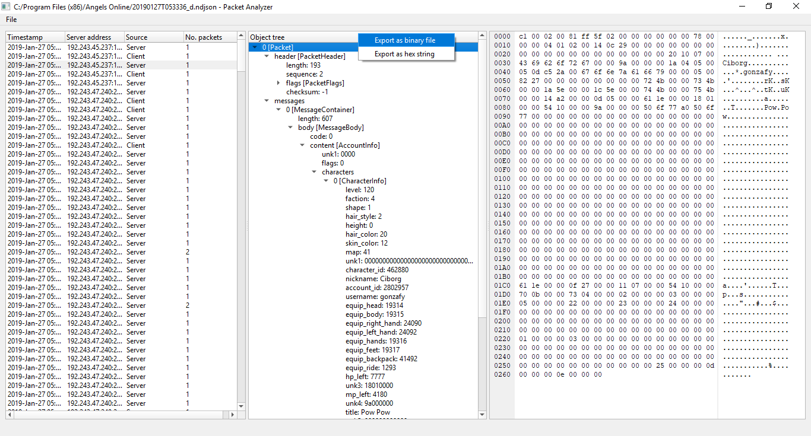

# Packet Analyzer v0.1.1

## Program

### Features

- Open decrypted packet logs
- Parse structures using kaitai description file
- Hex viewer
- Extract packet byte array as binary or hex file

#### Based on
- KaitaiStruct (https://kaitai.io/)
- Anytree (https://anytree.readthedocs.io/en/2.6.0/)
- Pyside2 / Qt (https://wiki.qt.io/Qt_for_Python)

## Setup
#### 1- Download and install [Python 3.8.4](https://www.python.org/downloads/windows/)

Run the installer, check "Add python 3.8 to PATH" then clic "Install Now"

#### 2- Add python site-packages folder to path environment variable
From the next string, replace \<User\> (with quotes) for your windows user.

`C:\Users\<User>\AppData\Local\Programs\Python\Python38-32\Lib\site-packages`

Then add to your "PATH" environment variable. If you dont know how to do that check [this guide](https://www.architectryan.com/2018/03/17/add-to-the-path-on-windows-10/)

#### 3- Download dependences
To install dependences, open a console and run:

`py -m pip install -r requeriments.txt`

#### 4- Install kaitai-struct-compiler
This program is different from kaitaistruct installed with pip command.
Kaitai struct compiler is used to generate python source code based on a .ksy file.

Because there are required features that weren't yet released, need to install latest development version.
You can download it from the [official website](https://kaitai.io/#download)

You also must install Java Runtime Environment. Download it from https://www.java.com/en/download/

#### 5- You are ready to rock!
Remember to close the console and open a new one to start.

## Usage

To start the program, double click on "start.bat".